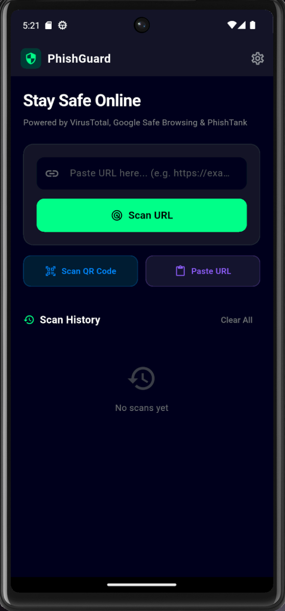

  PhishGuard 🛡️

A Flutter mobile app that detects phishing and malicious URLs in real-time.

  Screenshots

  

  
  
  

  
  
  

  

  Features

- Real-time URL scanning via VirusTotal (94+ engines)
- Google Safe Browsing API integration
- PhishTank pattern detection
- HTTPS status check
- Typosquatting detection
- Suspicious keyword analysis
- Scan history

  Setup

1. Clone the repo
2. Run flutter pub get
3. Add your API keys in lib/main.dart
4. Run flutter run

  API Keys needed

- VirusTotal: https://www.virustotal.com/gui/my-apikey
- Google Safe Browsing: https://console.cloud.google.com

  Built with

- Flutter 3.41
- VirusTotal API v3
- Google Safe Browsing API v4